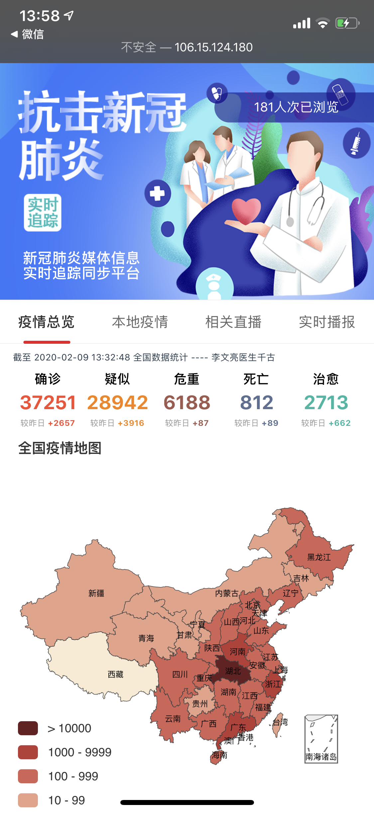
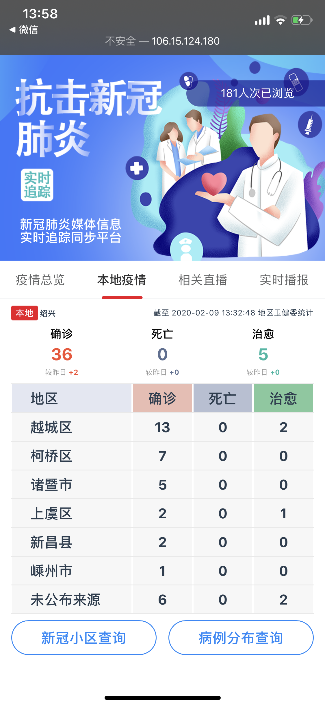
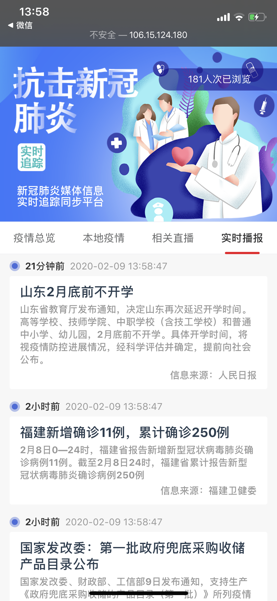

# ncovh5 新冠病毒综合信息网页

根据丁香园数据（接口来源：[天行数据](https://www.tianapi.com/)），按主流结构制作的新冠病毒综合信息网页，内含全国数据、本地疫情、相关直播、实时 讯息等模块，并包含其他小工具

项目已上线，仍在频繁迭代，为疫情贡献自己的一份力量

同时致敬那些奋斗在一线的医疗人员们

## 预览

项目地址，点击 [传送门](http://106.15.124.180/ncovh5/)，支持多端访问，移动端打开更

预览图片：





## 数据来源

全国疫情接口采用天行数据的接口，来源应为丁香园；同时聚合了一些第三方的数据接口

## 项目依赖

- Vue
- Vant
- Axios
- Echarts

## 项目配置

### 数据接口

需要申请天行数据的用户账户，并获得其 Key，然后替换

```js
// 天行数据接口配置
const data = {
    key: 'xxxxxx'
}
```

### 项目编译 

```bash
# 安装依赖
sudo yarn
# 开发环境编译
yarn serve
# 生产环境编译
sudo yarn build
```